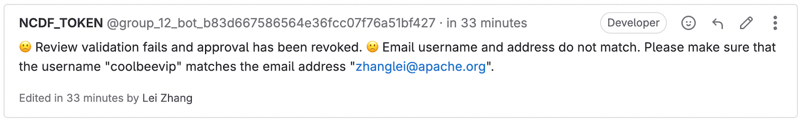
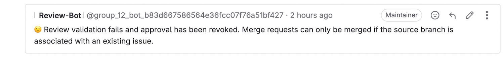
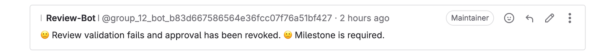
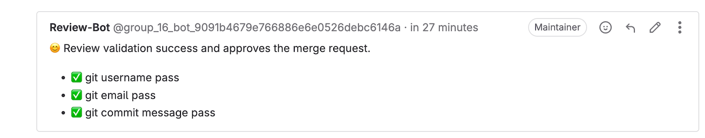

# Gitlab Bot 


This is a GitLab(13.2+) bot that utilizes [webhooks](https://docs.gitlab.com/ee/user/project/integrations/webhook_events.html) to automate certain tasks:

#### Verify if the submitters email domain during Merge requests.

> 

#### Verify if the submitters email username and username match during Merge requests.

> 

#### Merge requests can only be merged if the source branch is associated with an existing issue.

> 

#### Confirm if a milestone has been specified in Merge requests.

> 

#### Validate if the commit titles adhere to the [Conventional Commits Specification](https://www.conventionalcommits.org/) in Merge requests.

> 

#### Review Success

> 

#### Generate Release Notes for a designated milestone in Issues by utilizing the /bot-release-note command.

> 

#### Generates a summary for GitLab merge requests by OpenAI.

> 

## GitLab Event Support

* Push Events (Not yet)
* Issue Events
* Comment Events
    * Commits
    * Merge Requests
    * Issues
    * Code Snippets (Not yet)
* Merge Request Events
* Wiki Page Events (Not yet)
* Tag Events (Not yet)
* Pipeline Events (Not yet)
* Build Events (Not yet)

## How to use

Starting a Gitlab Bot instance is simple:

> In Docker version 19, utilizing the "--security-opt seccomp:unconfined" option when running a container with a preconfigured seccomp profile can disable the seccomp filter and allow processes to execute any system call.

```shell
docker run --rm \
-e BOT_GITLAB_USERNAME="Your Gitlab Username" \
-e BOT_GITLAB_URL="Your Gitlab URL" \
-e BOT_GITLAB_TOKEN="Your Gitlab Access Token" \
-p 9998:9998 \
coolbeevip/gitlab-bot
```

## Environment Variables

**`BOT_GITLAB_USERNAME` / `BOT_GITLAB_URL` / `BOT_GITLAB_TOKEN`**

These variables are used to configure the GitLab bot's authentication with the GitLab API. Please provide the following information:

- `BOT_GITLAB_USERNAME`: The username of the bot account on GitLab.(**Be sure to create a new user and use that user's access token, not the group access token or the project access token.**)
- `BOT_GITLAB_URL`: The URL of the GitLab instance the bot will be interacting with.
- `BOT_GITLAB_TOKEN`: The token used to authenticate the bot with the GitLab API.

**`BOT_LANGUAGE`** 

Supports both Chinese (zh) and English (en) languages by default.

**`BOT_HOST` / `BOT_PORT`**

These variables specify the host and port on which the bot will run. By default, the bot will run on the IP address 0.0.0.0 and port number 9998.

**`BOT_GIT_EMAIL_DOMAIN`**

This configuration specifies the email domain that will be used for email addresses when making Git commits. For example:

```shell
BOT_GIT_EMAIL_DOMAIN=gmail.com
```

**`BOT_GIT_COMMIT_SUBJECT_MAX_LENGTH`**

The maximum character length allowed for Git commit subjects is 100, which is the default value.

**`BOT_GIT_COMMIT_SUBJECT_REGEX` / `BOT_GIT_COMMIT_SUBJECT_EXAMPLES_MARKDOWN` / `BOT_GIT_COMMIT_SUBJECT_REGEX_ENABLED`**

Regular expression pattern [Conventional Commits Specification](https://www.conventionalcommits.org/) and example commit subjects are used to validate and provide guidance for Git commit messages. Here is an example of how to use them:

```shell
BOT_GIT_COMMIT_SUBJECT_REGEX_ENABLED="true"
BOT_GIT_COMMIT_SUBJECT_REGEX="^(fix|feat|docs|style|refactor|test|chore|build|ci): .*$"
BOT_GIT_COMMIT_SUBJECT_EXAMPLES_MARKDOWN="* feat: Add authentication module\n* fix: Resolve issue with login not working\n* docs: Update README with installation instructions\n* style: Format code according to the coding guidelines\n* refactor: Extract reusable function for file upload\n* test: Add unit tests for payment processing module\n* build: Upgrade to Node.js version 14.0\n* ci: Update Travis CI configuration for better test coverage\n* chore: Update .gitignore file"
```

These variables are used to enforce a consistent commit message format for the Git repository. The `BOT_GIT_COMMIT_SUBJECT_REGEX_ENABLED` is set to "true" to enable the validation of commit subjects using the regular expression pattern specified in `BOT_GIT_COMMIT_SUBJECT_REGEX`.

The `BOT_GIT_COMMIT_SUBJECT_REGEX` contains a regular expression pattern that matches commit subjects following the Conventional Commits Specification. This pattern ensures that commit subjects start with a specific type (e.g., "fix", "feat", "docs") followed by a colon and a space, and then any additional description. **Merge commits are excluded from this validation.**

The `BOT_GIT_COMMIT_SUBJECT_EXAMPLES_MARKDOWN` provides a list of example commit subjects following the specified format. These examples can be used as a guideline when writing commit messages.

**`BOT_GITLAB_MERGE_REQUEST_MILESTONE_REQUIRED`**

In GitLab, it is necessary to set a milestone when creating a merge request. By default, this requirement is disabled.

**`BOT_GITLAB_MERGE_REQUEST_ISSUE_REQUIRED`**

Merge requests can only be merged if the source branch is associated with an existing issue. By default, this requirement is disabled.

**`OPENAI_API_BASE` / `OPENAI_API_KEY` / `OPENAI_API_MODEL`**

These parameters are used to connect the OPENAI model.

**`GOOGLE_API_KEY` / `GOOGLE_API_MODEL`**

These parameters are used to connect Google models.

**`AZURE_OPENAI_API_KEY` / `AZURE_OPENAI_API_VERSION` / `AZURE_OPENAI_MODEL` / `AZURE_OPENAI_ENDPOINT`**

These parameters are used to connect Azure OpenAI models.

**`AI_PROVIDER`**

This parameter specifies the AI model backend to use. The default value is `openai`, but you can switch to `google` for Google models or `azure-openai` for Azure OpenAI models.

**`BOT_GITLAB_MERGE_REQUEST_SUMMARY_ENABLED` / `BOT_GITLAB_MERGE_REQUEST_SUMMARY_LANGUAGE`**

The `BOT_GITLAB_MERGE_REQUEST_SUMMARY_ENABLED` parameter controls whether the system generates a summary for GitLab merge requests. By default, it is set to `true`.
The `BOT_GITLAB_MERGE_REQUEST_SUMMARY_LANGUAGE` parameter specifies the language in which the generated merge request summaries will be written. By default, it is set to `English`. However, you can change it to any preferred language code if needed.

**`BOT_GITLAB_MERGE_REQUEST_EMAIL_USERNAME_NOT_MATCH_ENABLED`**

Merge requests can only be merged if the email username (before the "@") matches the commit author's name. By default, this requirement is disabled.

**`BOT_GIT_COMMIT_MESSAGE_CHECK_ENABLED`**

Merge requests can only be merged if the commit message follows a specific format. When it's set to `true`, the bot will validate commit messages based on a specified regex defined by the `BOT_GIT_COMMIT_SUBJECT_REGEX` environment variable.

**`BOT_GITLAB_MERGE_REQUEST_APPROVAL_ENABLED`**

This parameter controls whether the bot automatically approves merge requests that pass all checks. By default, it is set to `true`, allowing the bot to automatically approve merge requests. Setting it to `false` disables automatic approval, requiring manual approval for all merge requests.

**`BOT_GITLAB_MERGE_REQUEST_AIREVIEW_LABEL_ENABLED`**

This parameter controls the feature to add a new status label "AI Review" to merge requests, facilitating better tracking of AI-assisted code reviews. When enabled, the label is automatically added when AI summary generation is enabled and completed. The label is removed when a Merge Request is updated but the AI feature is disabled.

By default, this feature is enabled. To disable it, set the `BOT_GITLAB_MERGE_REQUEST_AIREVIEW_LABEL_ENABLED` environment variable to "false". This feature is particularly useful for projects that heavily rely on AI-assisted code reviews to ensure that all code changes are thoroughly examined before merging.
