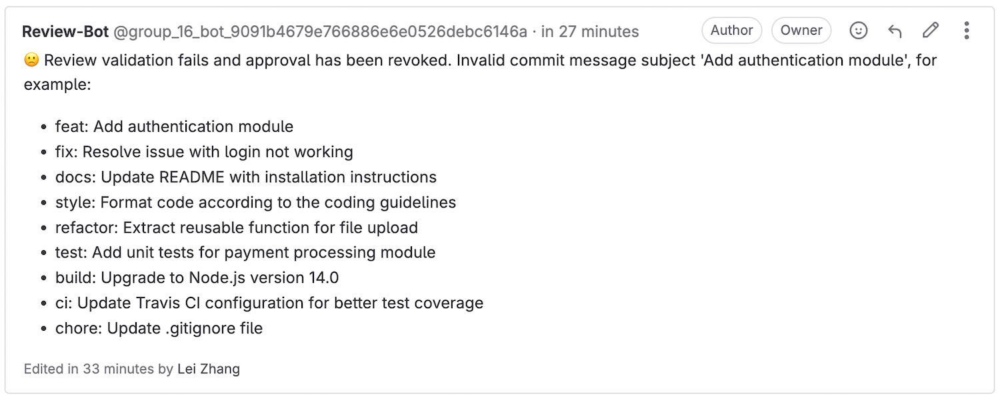
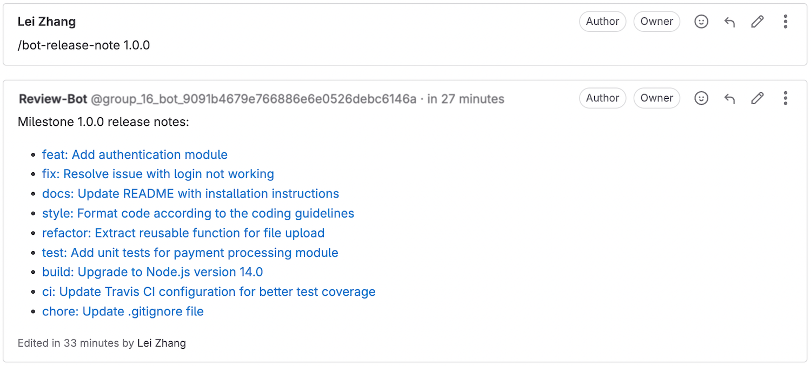

# Gitlab Bot | [中文](README.cn.md)


[](https://opensource.org/licenses/Apache-2.0)

这是一个适用于 GitLab(13.2+) 的机器人，利用 [webhooks](https://docs.gitlab.com/ee/user/project/integrations/webhook_events.html) 来自动化一些任务

## 功能

#### 在合并请求中验证提交者的电子邮件域名。

> 

#### 在合并请求中验证提交者的电子邮件用户名与用户名是否匹配。

> 

#### 只有当源分支与现有问题相关联时，才能合并合并请求。

> 

#### 确认在合并请求中是否指定了里程碑。

> 

#### 验证合并请求中的提交标题是否符合 [约定提交规范](https://www.conventionalcommits.org/)。

> 

#### 检查成功

> 

#### 使用 /bot-release-note 命令为指定的里程碑生成发布说明。

> 

#### 通过 OpenAI 生成 GitLab 合并请求的摘要。

> 

## GitLab 事件支持

* 推送事件（尚未支持）
* 问题事件
* 评论事件
    * 提交
    * 合并请求
    * 问题
    * 代码片段（尚未支持）
* 合并请求事件
* 维基页面事件（尚未支持）
* 标签事件（尚未支持）
* 管道事件（尚未支持）
* 构建事件（尚未支持）

## 如何使用

为了启动 GitLab Bot，您需要准备三个环境变量：`BOT_GITLAB_USERNAME`、`BOT_GITLAB_URL` 和 `BOT_GITLAB_TOKEN`。

- **BOT_GITLAB_USERNAME**：这是您的 GitLab 用户名，用于识别您在 GitLab 上的账户。您可以在您的 GitLab 个人资料页面找到它。**(建议您为此创建一个新的用户，例如 `review-bot`)**
  
- **BOT_GITLAB_URL**：这是您的 GitLab 实例的 URL。如果您使用的是 GitLab.com，则 URL 将是 `https://gitlab.com`。如果您正在运行自托管的 GitLab 实例，请使用为其配置的 URL（例如 `http://your-gitlab-instance.com`）。

- **BOT_GITLAB_TOKEN**：这是 `BOT_GITLAB_USERNAME` 的访问令牌，授予机器人与您的 GitLab 实例交互的权限。您可以通过以下步骤生成个人访问令牌：
  1. 登录到您的 GitLab 账户。
  2. 转到您的用户设置（点击右上角的个人资料图片，然后选择设置）。
  3. 导航到 `访问令牌`。
  4. 生成令牌并确保安全保存，因为它只会显示一次。
  
#### 启动 Gitlab Bot

> 在 Docker 版本 19 中，使用 “--security-opt seccomp:unconfined” 选项运行容器时，可以禁用 seccomp 过滤器，允许进程执行任何系统调用。

```shell
docker run --rm \
-e BOT_GITLAB_USERNAME="review-bot" \
-e BOT_GITLAB_URL="http://your-gitlab-instance.com" \
-e BOT_GITLAB_TOKEN="<用户 review-bot 的 access token>" \
-p 9998:9998 \
coolbeevip/gitlab-bot
```
#### 在 GitLab 中设置 Webhook

为了使 GitLab Bot 能够响应事件，您需要在 GitLab 项目中配置 Webhook。请按照以下步骤操作：

1. **打开项目视图**：
   - 登录到 GitLab。
   - 在仪表板中找到并点击您的项目。

2. **进入 Webhook 设置**：
   - 在左侧边栏菜单中，导航到 `设置` -> `Webhooks`。

3. **添加新的 Webhook**：
   - 点击 `添加新 webhook` 按钮。

4. **填写信息**：
   - 在出现的表单中，填写以下详细信息：
     - **URL**：输入将接收 Webhook 请求的地址，例如 `http://localhost:9998`。
     - **触发**：
       - 选择您希望触发 Webhook 的事件，例如：
         - `评论`（评论事件）
         - `问题事件`（问题事件）
         - `合并请求事件`（合并请求事件）

5. **保存 Webhook**：
   - 点击 `添加 webhook` 按钮以保存您的配置。

6. **测试 Webhook（可选）**：
   - 为确认 Webhook 是否设置正确，在 Webhooks 列表中找到新添加的 Webhook，并使用 `测试` 按钮发送测试请求。
   
## 环境变量

**`BOT_GITLAB_USERNAME` / `BOT_GITLAB_URL` / `BOT_GITLAB_TOKEN`**

这些变量用于配置 GitLab 机器人与 GitLab API 的认证。请提供以下信息：

- `BOT_GITLAB_USERNAME`：GitLab 上机器人的账号用户名。（**确保创建一个新用户并使用该用户的访问令牌，而不是组访问令牌或项目访问令牌。**）
- `BOT_GITLAB_URL`：机器人将与之交互的 GitLab 实例的 URL。
- `BOT_GITLAB_TOKEN`：用于通过 GitLab API 验证机器人的令牌。

**`BOT_LANGUAGE`**

默认支持中文（zh）和英语（en）两种语言。

**`BOT_HOST` / `BOT_PORT`**

这些变量指定机器人运行的主机和端口。默认情况下，机器人将在 IP 地址 0.0.0.0 和端口号 9998 上运行。

**`BOT_GIT_EMAIL_DOMAIN`**

该配置指定在进行 Git 提交时使用的电子邮件域名。例如：

```shell
BOT_GIT_EMAIL_DOMAIN=gmail.com
```

**`BOT_GIT_COMMIT_SUBJECT_MAX_LENGTH`**

允许的 Git 提交主题的最大字符长度为 100，这是默认值。

**`BOT_GIT_COMMIT_SUBJECT_REGEX` / `BOT_GIT_COMMIT_SUBJECT_EXAMPLES_MARKDOWN` / `BOT_GIT_COMMIT_SUBJECT_REGEX_ENABLED`**

用于验证 Git 提交消息的正则表达式模式 [约定提交规范](https://www.conventionalcommits.org/) 和示例提交主题。以下是使用示例：

```shell
BOT_GIT_COMMIT_SUBJECT_REGEX_ENABLED="true"
BOT_GIT_COMMIT_SUBJECT_REGEX="^(fix|feat|docs|style|refactor|test|chore|build|ci): .*$"
BOT_GIT_COMMIT_SUBJECT_EXAMPLES_MARKDOWN="* feat: 添加认证模块\n* fix: 解决登录无法正常工作的问题\n* docs: 更新 README 以包含安装说明\n* style: 根据编码规范格式化代码\n* refactor: 提取可重复使用的文件上传函数\n* test: 为支付处理模块添加单元测试\n* build: 升级到 Node.js 版本 14.0\n* ci: 更新 Travis CI 配置以涵盖更好的测试\n* chore: 更新 .gitignore 文件"
```

这些变量用于强制 Git 仓库的一致提交消息格式。将 `BOT_GIT_COMMIT_SUBJECT_REGEX_ENABLED` 设置为 "true" 可启用使用 `BOT_GIT_COMMIT_SUBJECT_REGEX` 中指定的正则表达式模式进行提交主题验证。

`BOT_GIT_COMMIT_SUBJECT_REGEX` 包含一个正则表达式模式，匹配符合约定提交规范的提交主题。此模式确保提交主题以特定类型（例如 "fix"、"feat"、"docs"）开头，后面跟着冒号和空格，然后是任何额外的描述。**合并提交不包含在此验证中。**

`BOT_GIT_COMMIT_SUBJECT_EXAMPLES_MARKDOWN` 提供了一系列遵循指定格式的示例提交主题。这些示例可以在编写提交消息时作为指导。

**`BOT_GITLAB_MERGE_REQUEST_MILESTONE_REQUIRED`**

在 GitLab 中，创建合并请求时必须设置一个里程碑。默认情况下，此要求处于禁用状态。

**`BOT_GITLAB_MERGE_REQUEST_ISSUE_REQUIRED`**

只有当源分支与现有问题相关联时，才能合并合并请求。默认情况下，此要求处于禁用状态。

**`OPENAI_API_BASE` / `OPENAI_API_KEY` / `OPENAI_API_MODEL`**

这些参数用于连接 OPENAI 模型。

**`GOOGLE_API_KEY` / `GOOGLE_API_MODEL`**

这些参数用于连接 Google 模型。

**`AZURE_OPENAI_API_KEY` / `AZURE_OPENAI_API_VERSION` / `AZURE_OPENAI_MODEL` / `AZURE_OPENAI_ENDPOINT`**

这些参数用于连接 Azure OpenAI 模型。

**`AI_PROVIDER`**

该参数指定要使用的 AI 模型后端。默认值为 `openai`，但您可以切换为 `google`（用于 Google 模型）或 `azure-openai`（用于 Azure OpenAI 模型）。

**`BOT_GITLAB_MERGE_REQUEST_SUMMARY_ENABLED` / `BOT_GITLAB_MERGE_REQUEST_SUMMARY_LANGUAGE` / `BOT_GITLAB_MERGE_REQUEST_SUMMARY_PROMPT_RULE`**

`BOT_GITLAB_MERGE_REQUEST_SUMMARY_ENABLED` 参数控制系统是否生成 GitLab 合并请求的摘要。默认设置为 `true`。
`BOT_GITLAB_MERGE_REQUEST_SUMMARY_LANGUAGE` 参数指定生成的合并请求摘要的语言。默认设置为 `English`。但您可以根据需要更改为任何首选的语言代码。
`BOT_GITLAB_MERGE_REQUEST_SUMMARY_PROMPT_RULE` 参数指定生成合并请求摘要的提示规则。您可以根据需要更改为任何首选的提示规则，例如：`1. 请高度概括并总结\n2. 请使用中文输出`。

**`BOT_GITLAB_MERGE_REQUEST_EMAIL_USERNAME_NOT_MATCH_ENABLED`**

只有当电子邮件用户名（“@”前的部分）与提交作者的名称匹配时，才能合并合并请求。默认情况下，此要求处于禁用状态。

**`BOT_GIT_COMMIT_MESSAGE_CHECK_ENABLED`**

只有当提交消息遵循特定格式时，才能合并合并请求。当设置为 `true` 时，机器人将根据 `BOT_GIT_COMMIT_SUBJECT_REGEX` 环境变量定义的指定正则表达式验证提交消息。

**`BOT_GITLAB_MERGE_REQUEST_APPROVAL_ENABLED`**

该参数控制机器人是否自动批准通过所有检查的合并请求。默认设置为 `true`，允许机器人自动批准合并请求。将其设置为 `false` 则禁用自动批准，需要对所有合并请求进行手动批准。

**`BOT_GITLAB_MERGE_REQUEST_AIREVIEW_LABEL_ENABLED`**

该参数控制向合并请求添加新状态标签 "AI Review" 的功能，从而更好地跟踪 AI 辅助的代码审查。当启用时，当生成 AI 摘要时，会自动添加该标签。更新合并请求时标签会被移除，但 AI 功能被禁用。

默认情况下，此功能是启用的。如要禁用，请将 `BOT_GITLAB_MERGE_REQUEST_AIREVIEW_LABEL_ENABLED` 环境变量设置为 "false"。该功能特别适用于依赖 AI 辅助代码审查的项目，以确保所有代码更改在合并之前进行彻底审查。